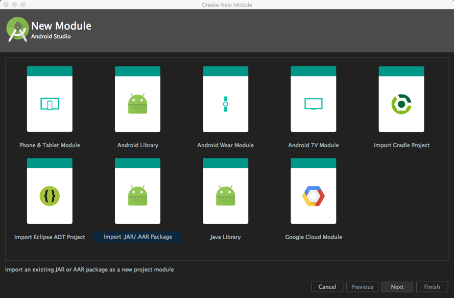
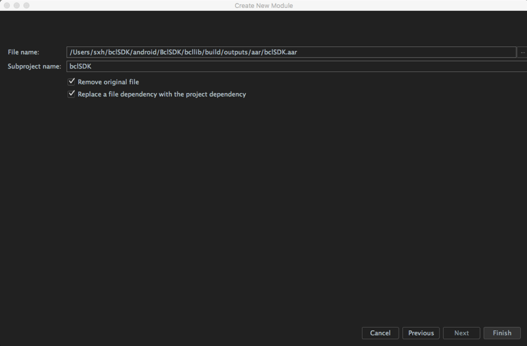

# 行动应用开发

## Android 行动应用

### 1. 导入 SDK 库
在 Project Structure 里选择 File/Project Structure, 点击左上角的 + 进入 New Moudule
流程(注意不是添加 Module dependency)



选择 `Import JAR/arr Package`，点击Next




点击 `Finish`
选择 `Module dependency` 里将 `bclSDK` Moudle 添加到项目里即可


### 2. 初始化 bclSDK

### 3. 登录账号

### 4. 调用接口

## iOS 行动应用

所提供的 iOS SDK 支持 iOS 8 以上版本的系统环境。

### 1.导入 SDK 库

工程内手动添加 bclSDK.framework 库(工程中-> General -> Embedded Binaries 点击加号，然后添加 bclSDK.framework)


### 2.引入 SDK 头文件

在需要位置引入 SDK 头文件
`#import <bclSDK/bclSDK.h>`

### 3.初始化 bclObject

应用启动时,在 AppDelegate.m 中初始化 bclObject,

```
    [[bclObject sharedInstance] initWithUrl: @"<主神链 API URL>"
    Name:@"MTN 新链"
    Core_Asset:@"MTN"
    Faucet_url: @"<主神链水龙头 URL>"
    ChainId:@"<主神链 chain ID>"
    Callback:^(NSDictionary *responseDict) {
        NSLog(@"Init result:\r\n %@", responseDict);

    }];
```


### 4. 登录账号

在初始化bclObject后, 才可调用登录账号接口

```
    [bclObject.sharedInstance LoginWithName:@"用户名" pwd:@"密码" Callback:^(NSDictionary *responseDict) {
        NSLog(@"%@", responseDict);
        
        NSInteger status = [responseDict[@"status"] integerValue];
        if (status == 1) {
            NSLog(@"登入成功");
        }
        else {
            NSString *statusText = responseDict[@"statusText"];
            NSLog(@"登入失败: %@", statusText);
        }
    }];
```

### 5.调用接口

在应用需要调用 SDK 接口方法时,通过`[bclObject shareInstance]`对象调用

