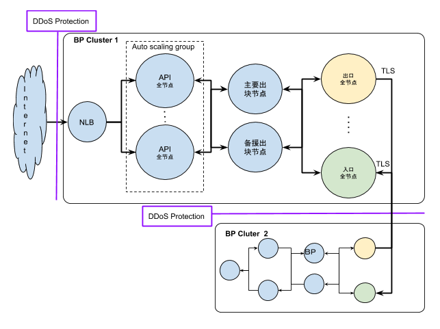

# 安装节点

参与主神联盟链，提供出块/超级节点的公司，需要提供区块链节点所需的服务器以及频宽。本文基于「主神联盟链技术白皮书」所建议的部署架构，说明如何安装与设定联盟链程式。

## 部署架构

逻辑上，虽然是一个联盟链的出块节点，但基于服务的可用性、安全性、扩充性，需要使用一组服务器以及相关网路服务。每组服务器部署在一个可用区(Availability Zone; AZ)或者数据中心(data center)；另外，为了网路存取控制，主机(服务器)被划分成 3 的子网路(subnet)，以及对应的安全领域(security domain)。

下图呈现建议的网路架构：



## 准备工作

为了方便后续章节描述，下列表格定义之后会采用的变数名称以及定义：

| 名称           | 说明                         | 缺省值                           |
| -------------- | ---------------------------- | -------------------------------- |
| $NODE_ROOT     | 节点程式安装的路径           | /opt/zeus                        |
| $NODE_DATA_DIR | 节点程式运行所需的数据       | $NODE_ROOT/witness_node_data_dir |
| $SOURCE_PATH   | 程式执行档以及设定档来源路径 | ~/zeus                           |
| $RPC_PORT      | RPC 的端口                   | 8090                             |
| $P2P_PORT      | P2P 通讯用端口               | 34567                            |

安装过程需要有下列档案：

| 档名         | 说明           | 备注                     |
| ------------ | -------------- | ------------------------ |
| witness_node | 节点主程式     | 支援 Ubuntu 16.06 x86_64 |
| cli_wallet   | 钱包命令列介面 | 建立以及管理帐户         |
| config.ini   | 节点程序设定档 | 范例档                   |
| genesis.json | 区块链创世文件 |                          |

### 主机需求

| 规格名称   | 规格说明                              | 适用主机                                        |
| ---------- | ------------------------------------- | ----------------------------------------------- |
| m4.4xlarge | vCPU: 16 cores/RAM: 64GiB/SSD: 100GiB | _ 主要出块节点<br> _ 备援出块节点               |
| m4.xlarge  | vCPU: 4 cores/RAM: 16GiB/SSD: 100GiB  | _ API 全节点<br> _ 出口全节点<br> \* 入口全节点 |

### 系统需求

| 项目         | 需求         | 备注 |
| ------------ | ------------ | ---- |
| 操作系统(OS) | Ubuntu 16.04 |      |

### 申请成为出块会员

要申请成为出块会员，需要先有一个普通帐户。可以透过主神链发起方所提供的网页钱包建立一个普通帐户。有了普通帐户的名称与私钥，可以透过互操作命令介面 cli_wallet 申请成为出块会员。

假设运维人员已经登入某台节点服务器，在终端机执行下列指令启动互操作介面：

```bash
$ cd /opt/zeus
$ ./cli_wallet ws://<节点 IP 地址>:8090(rpc port)
```

其中，<节点 IP 地址> 是联盟链已经在执行的节点主机。
下面指令都是在 cli_wallet 的介面中执行。

### 解锁钱包客户端

```bash
set_password <要创建的客户端密码>
unlock <客户端密码>
```

### 导入现有钱包

将现有帐户的私钥导入。

```bash
import_key <帐户名> <私钥>  true
```

导入成功后会更新钱包文件，可以透过 `list_my_accounts` 查看有哪些帐户。

### 帐户升级成终身会员

```bash
upgrade_account <帐户名> true true
```

### 帐户升级成出块会员

升级成出块会员需要消耗虚拟币。

```bash
create_witness <帐户名>  <推广网站> true
```

其中，< 推广网站>是合作方提供推广信息用的网址。

## 程式安装

节点主机都需要按照下列各节描述的步骤安装节点程式。
安装相依套件

节点需要执行环境预先安装有相关的系统套件，在命令列中使用下列指令安装：

```shell
$ sudo apt-get install libbz2-dev libdb++-dev \
libdb-dev libssl-dev openssl \
 libreadline-dev libtool libcurl4-openssl-dev \
 libcurl4-openssl-dev libboost-all-dev
```

$ 为命令提示符号，不用输入。
建立运行路径
$ mkdir -p /opt/zeus

### 建立运行路径

```bash
$ mkdir -p /opt/zeus
```

### 复制节点执行档

```bash
$ cp $SOURCE_PATH/witness_node $NODE_ROOT/
$ chmod a+x $NODE_ROOT/witness_node
```

### 产生初始档案

节点程式数据路径需要初始化，执行下列指令：

```bash
$ chdir $NODE_ROOT
$ ./witness_node
```

上述会在 $NODE_ROOT 路径中产生一个 `witness_node_data_dir` 子路径，这个目录就是 $NODE_DATA_DIR 。

### 复制设定档

```bash
$ cp $SOURCE_PATH/config.ini $NODE_DATA_DIR/
```

这个设定档提供缺省或者建议的设定值，实际运行需要调整的设定在「程式设定」这一章说明。

## 出口/入口全节点

### 代理服务器安装

1. 安装软件

```bash
$ sudo add-apt-repository ppa:nginx/stable
$ sudo apt-get update
$ sudo apt-get install -y nginx-extras
```

2. 基本环境设定

编辑主要设定档 `/etc/nginx/nginx.conf`， 搜寻 ”include /etc/nginx/conf.d/_.conf;”，将 ”include /etc/nginx/conf.d/_.conf;”，移出 http { } 区块外。

新增设定档 `/etc/nginx/conf.d/ingress.conf`，内容如下(IP 位址与端口根据环境修改)))：

```nginx
stream {
    upstream mtningress {
        server 10.3.4.11:34567; ##本地端入口节点
    }

    server {

        listen 35789 ssl;
        tcp_nodelay on;
        proxy_pass mtningress;
        ssl_certificate /opt/ssl/zeusCA/motion.one.crt; ##入口节点证书
        ssl_certificate_key /opt/ssl/zeusCA/motion.one.key; ##入口节点私钥
        ssl_client_certificate /opt/ssl/zeusCA/ca.crt; ## 本地节点root CA，外部节点连线必须基于此CA产出Client证书
        ssl_protocols TLSv1 TLSv1.1 TLSv1.2;
        ssl_ciphers HIGH:!aNULL:!MD5;
        ssl_verify_client on; ## 开启连线客户端证书认证
        ssl_session_cache     shared:SSL:20m;
        ssl_session_timeout   4h;
        ssl_handshake_timeout 30s;
        proxy_connect_timeout 7d;
        allow xxx.xxx.xxx.xxx/32; ##外部连入本地节点来源IP
        deny all;
    }
}
```

新增 Engress 设定档 `/etc/nginx/conf.d/engress.conf`，内容如下：

```nginx
stream {
    upstream mtnengress {
        server 18.182.93.83:35789; ###联盟主炼入口节点 1
        server 18.182.82.151:35789; ###联盟主炼入口节点 2
    }

    server {

        listen 35789; #本地出口用端口，用来连线到联盟主链
        proxy_pass mtnengress;
        proxy_ssl on;
        proxy_ssl_certificate /opt/ssl/zeusCA/chain-client.crt; ##联盟主链提供公钥证书
        proxy_ssl_certificate_key /opt/ssl/zeusCA/cgain-client.key; ##提供给联盟主链产生证书私钥
        proxy_ssl_protocols TLSv1 TLSv1.1 TLSv1.2;
        proxy_ssl_ciphers HIGH:!aNULL:!MD5;
        proxy_ssl_verify_depth 2;
        proxy_ssl_session_reuse on;
        allow 10.3.0.0/16;
        deny all;
    }
}
```

3. 连线用 SSL 证书核发

**OpenSSL 环境变数修改**
编辑 `/usr/lib/ssl/openssl.cnf`档案

```
[ CA_default ]

dir             = /opt/ssl/zeusCA               # Where everything is kept
certs           = $dir/certs            # Where the issued certs are kept
crl_dir         = $dir/crl              # Where the issued crl are kept
database        = $dir/index.txt        # database index file.
#unique_subject = no                    # Set to 'no' to allow creation of
                                        # several ctificates with same subject.
new_certs_dir   = $dir/newcerts         # default place for new certs.

certificate     = $dir/cacert.pem       # The CA certificate
serial          = $dir/serial           # The current serial number
crlnumber       = $dir/crlnumber        # the current crl number
                                        # must be commented out to leave a V1 CRL
crl             = $dir/crl.pem          # The current CRL
private_key     = $dir/private/cakey.pem# The private key
RANDFILE        = $dir/private/.rand    # private random number file
```

**建立核发目录**

```
$ mkdir -p /opt/ssl/zeusCA/newcerts
$ mkdir -p /opt/ssl/zeusCA/private
$ cd /opt/ssl/zeusCA
$ touch index.txt
$ echo ‘01’ > serial
```

**建立 Root CA**

建立Root CA私钥

```
$ openssl genrsa -des3 -out ca.key 2048
```
产生无密码私钥
```
$ openssl rsa -in ca.key -out ca_decrypted.key
```
产生公钥
```
$ openssl req -new -x509 -days 18250 -key ca.key -out ca.crt
```

**建立连线证书**
```
建立连线用证书私钥
$ openssl genrsa -des3 -out motion.one.pem 2048

产生无密码私钥
$ openssl rsa -in motion.one.pem -out motion.one.key

产生签名档
$ openssl req -new -key motion.one.pem -out motion.one.csr

```

**连线证书签署**

签署证书
```
$ openssl ca -policy policy_anything -days 7300 -cert ca.crt -keyfile ca.key -in motion.one.csr -out motion.one.crt
```

追加 Root CA 内容
```
cat ca.crt>> motion.one.crt
```